## Part 1. Готовый докер

- Скачаем официальный образ nginx

    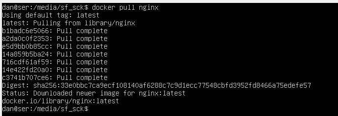

- Проверим наличие образа 

    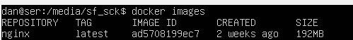

- Запустим контейнер

    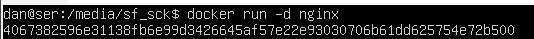

- Проверим, что образ запустился

    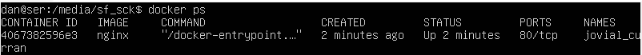

- Посмотрим информацию о контейнере через `docker inspect [container_id|container_name]`

    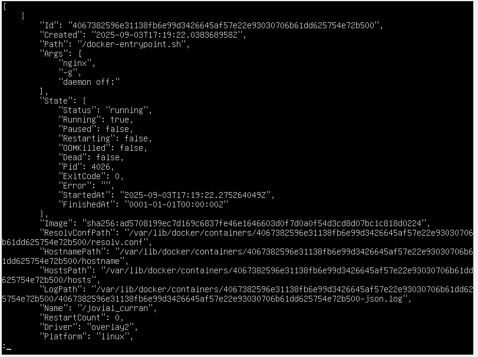

    - размер контейнера

        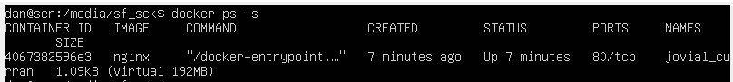

    - список замапленных портов
 
        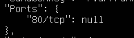

    - ip контейнера

        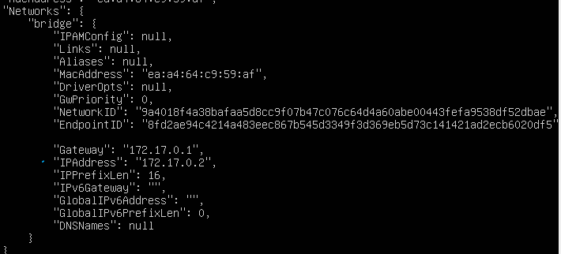

- Остановим докер контейнер и проверим это

    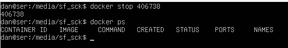

- Запустим докер с портами 80 и 443 в контейнере, замапленными на такие же порты на локальной машине, через команду `run`

    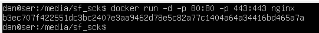

- В браузере по адресу `localhost:80` доступна стартовая страница nginx

    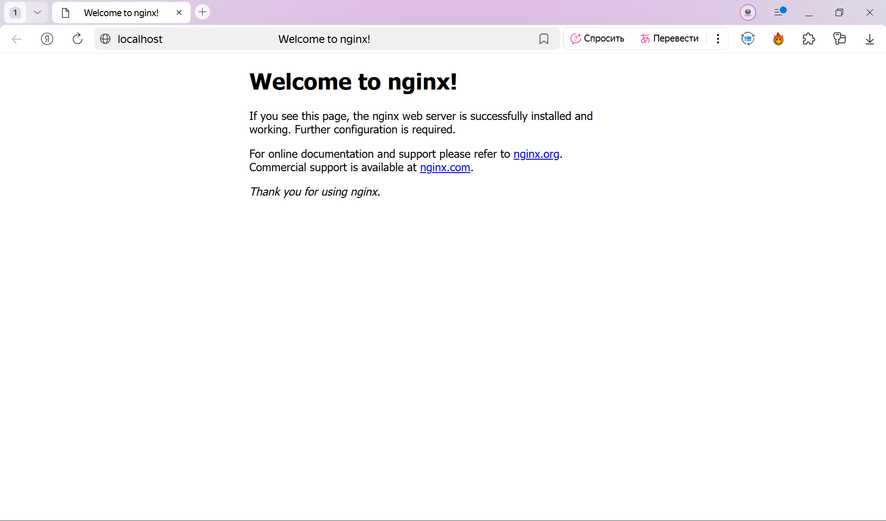

- Перезапустим докер контейнер и проверим, что он запустился

    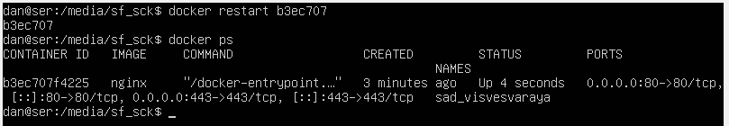

## Part 2. Операции с контейнером

- Прочитаем конфигурационный файл nginx.conf внутри докер контейнера через команду `exec`.                   

    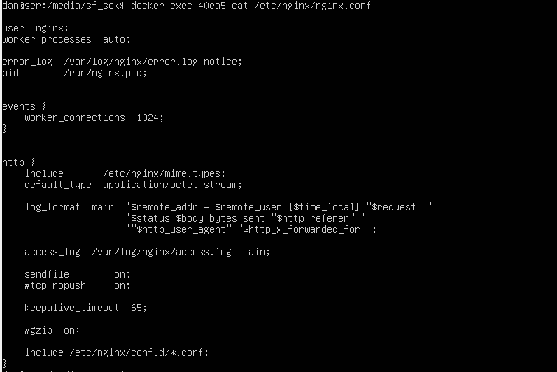

- Создадим на локальной машине файл nginx.conf и настроим в нем по пути /status отдачу страницы со статусом сервера nginx

    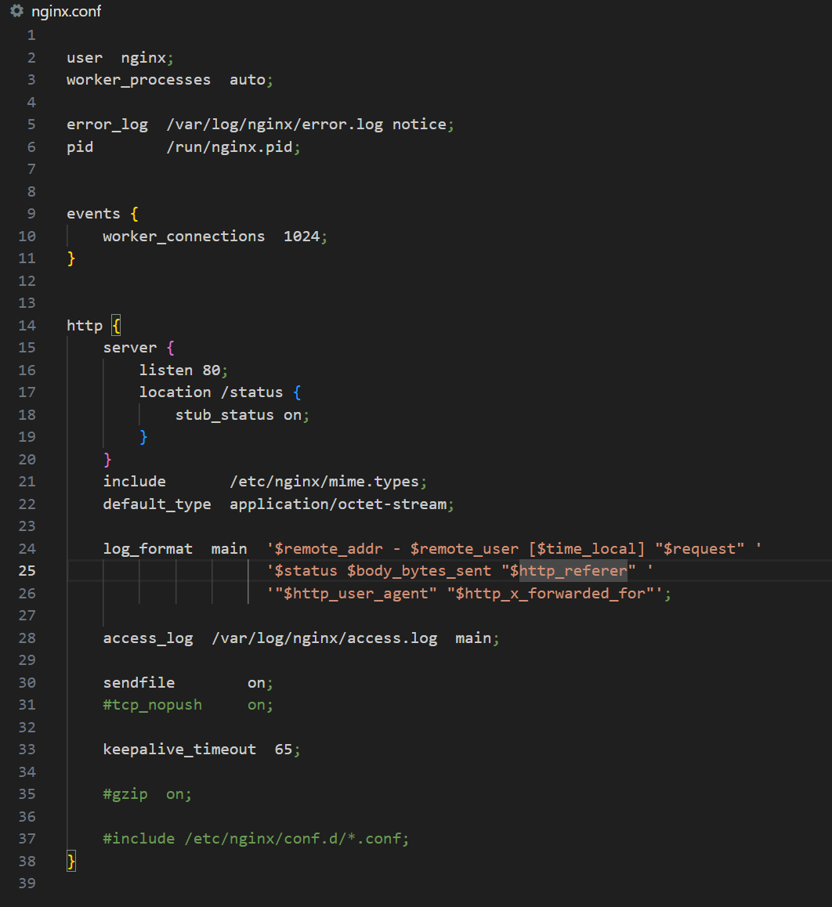

- Скопируем созданный файл nginx.conf внутрь докер-образа через команду `docker cp` 
                                                                                    
    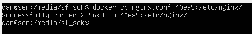

- Перезапустим nginx внутри докер-образа через команду `exec`

    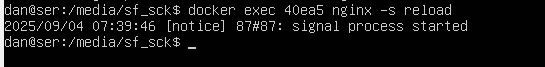

- Проверим, что по адресу localhost:80/status отдается страница со статусом сервера nginx                                                                                 
    
    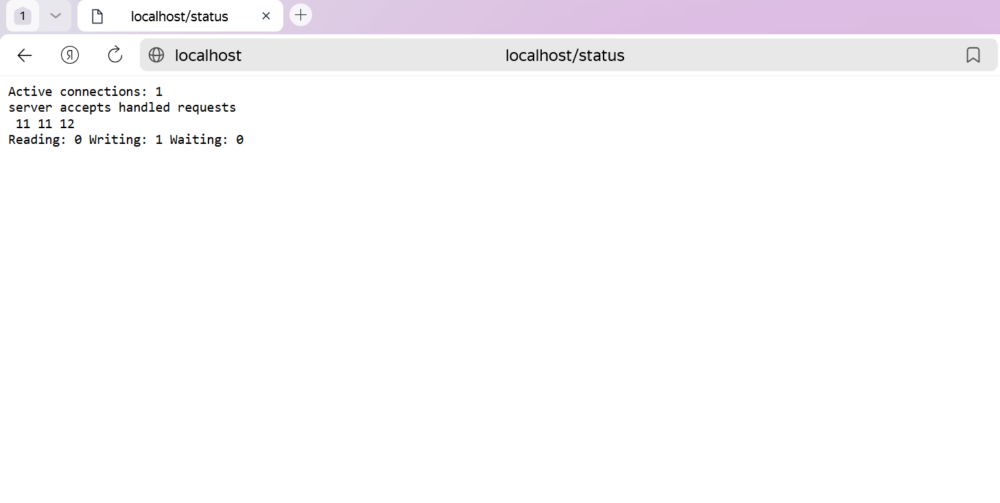

- Экспортируем контейнер в файл container.tar через команду `export` и остановим его

    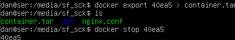

- Удалим образ через docker rmi [image_id|repository], не удаляя перед этим контейнеры и удалим остановленный контейнер

    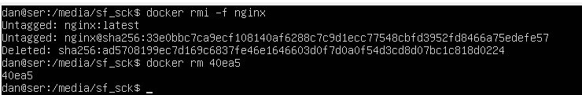

- Импортируем контейнер обратно через команду import и запустим этот контейнер   

    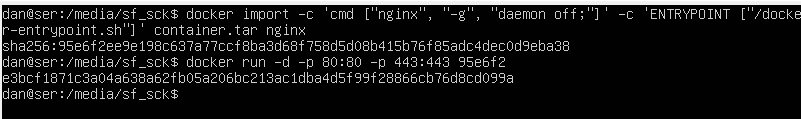

- Проверим, что по адресу localhost:80/status отдается страница со статусом сервера nginx

    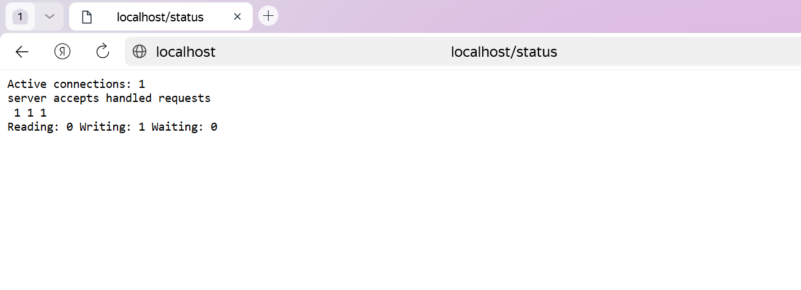

# Part 3. Мини веб-сервер

- Мини-сервер на C и FastCgi, который будет возвращать простейшую страничку с надписью Hello, World!.

    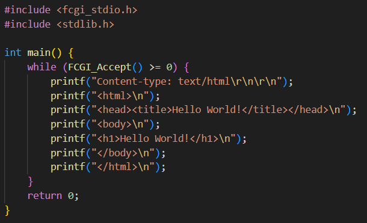

- Nginx.conf, который будет проксировать все запросы с 81 порта на 127.0.0.1:8080.

    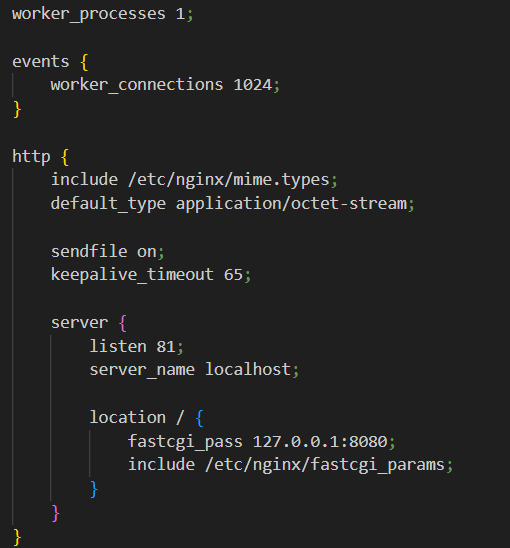

- Инициализируем изолированную среду для сборки и запуска приложения

    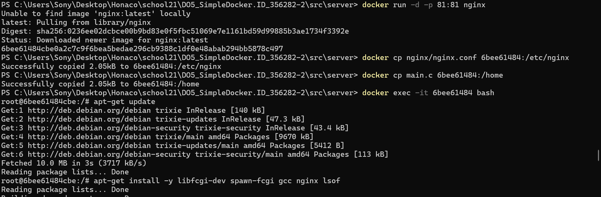
    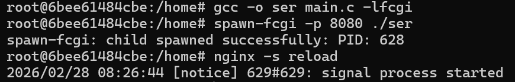

- В браузере по localhost:81 отдается написанная страничка.

    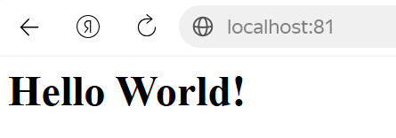

# Part 4. Свой докер

- Скрипт

    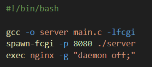

- Nginx.conf

    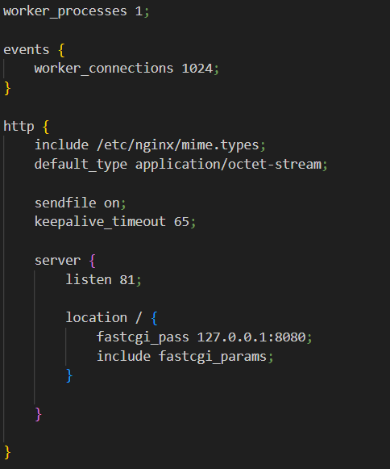

- Dockerfile

    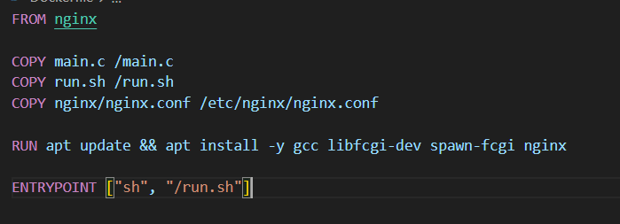

- Соберем написанный докер-образ и проверим через docker images, что все собралось корректно.

    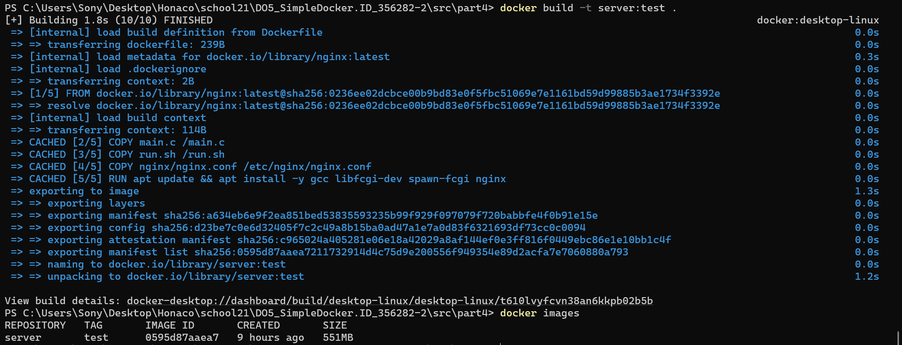

- Запустим собранный докер-образ с маппингом 81 порта на 80 на локальной машине и маппингом папки ./nginx внутрь контейнера по адресу, где лежат конфигурационные файлы nginx'а 

    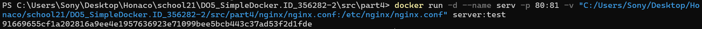

- В браузере по localhost:80 доступна страничка написанного мини сервера.

    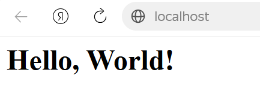

- Допишим в ./nginx/nginx.conf проксирование странички /status, по которой надо отдавать статус сервера nginx.

    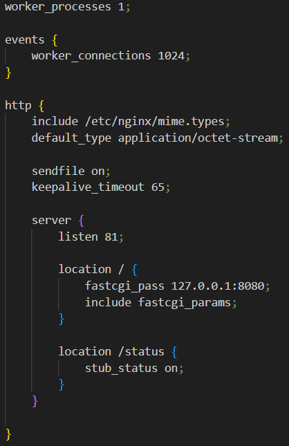

- Пересоберем докер-образ и проверим, что теперь по localhost:80/status отдается страничка со статусом nginx

    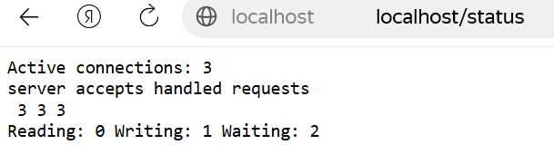

# Part 5. Dockle

- Просканируем образ из предыдущего задания через dockle [image_id|repository]

    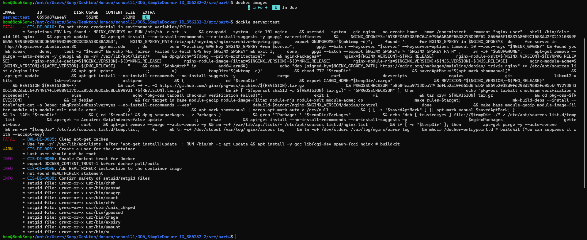

- Исправляем образ так, чтобы при проверке через dockle не было ошибок и предупреждений.

    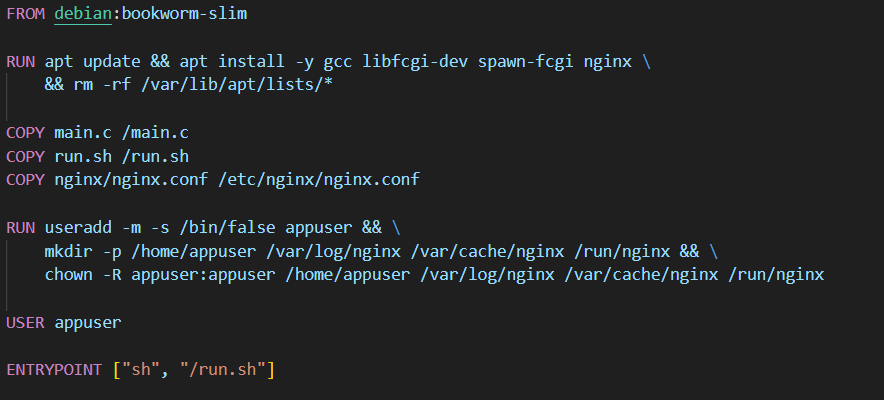
    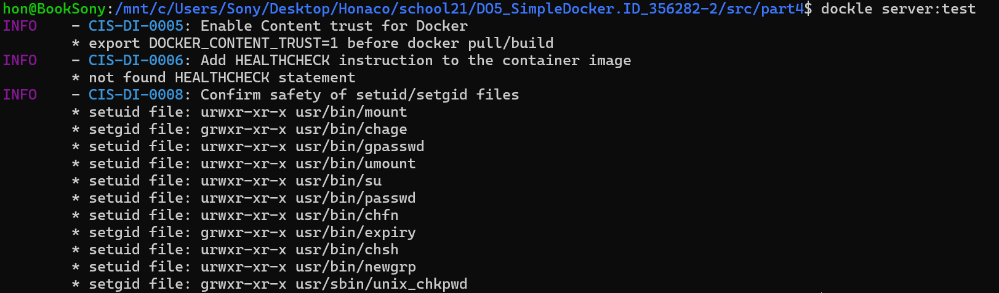

    - Осталась только INFO (Информация / Рекомендация)

# Part 6. Базовый Docker Compose

- nginx, который будет проксировать все запросы с 8080 порта на 81 порт первого контейнера

    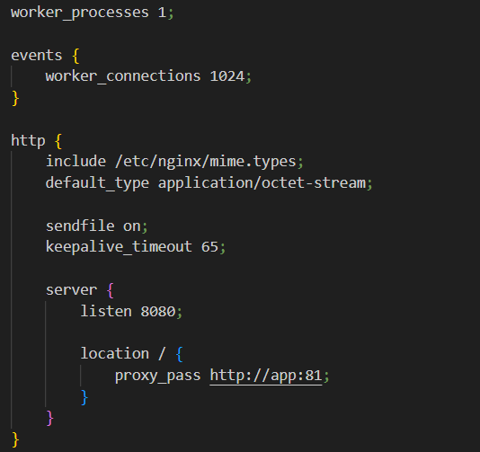

- docker-compose.yml

    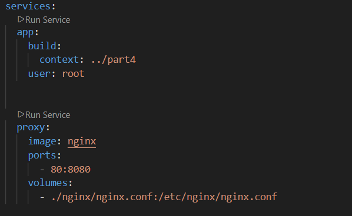

- Остановим все запущенные контейнеры, соберем и запустим проект

    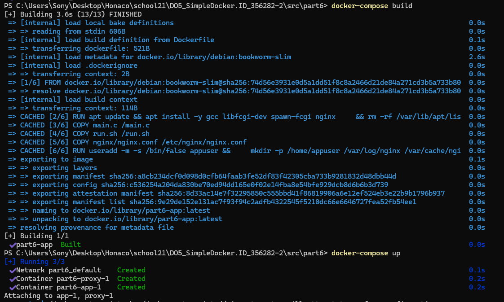

- В браузере по localhost:80 отдается написанная страничка, как и ранее

    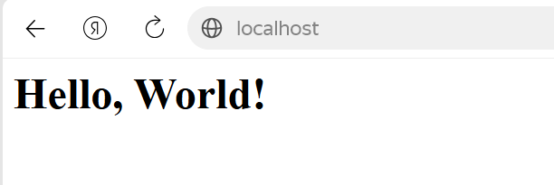